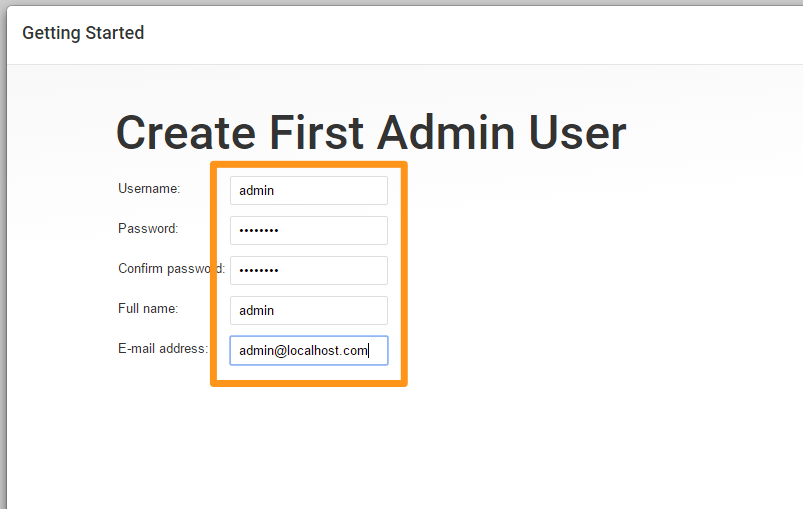
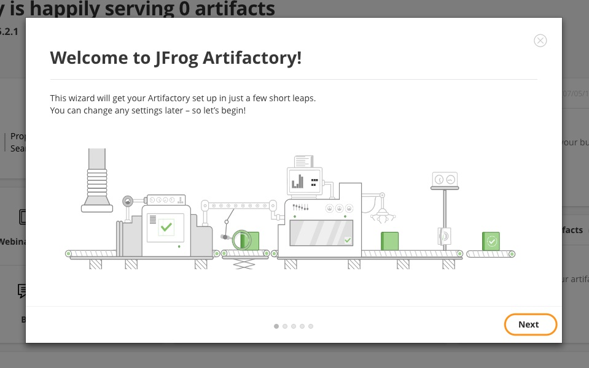
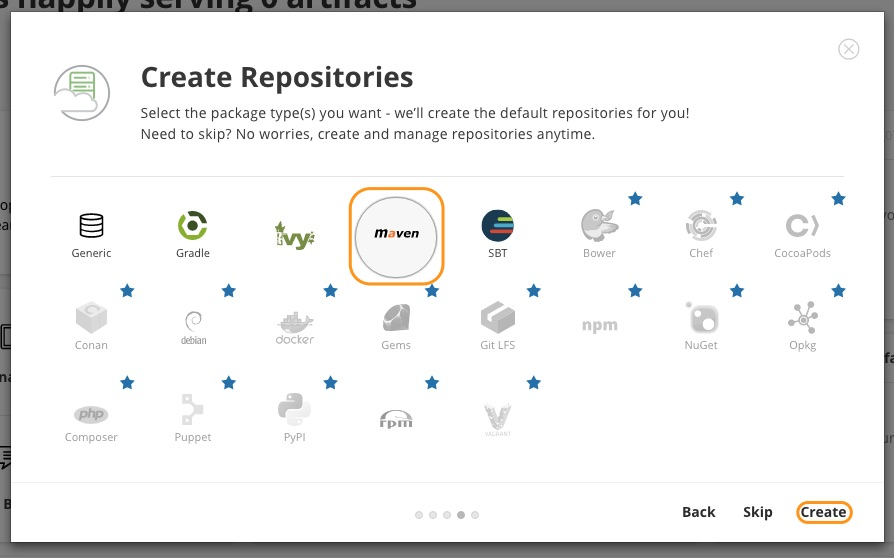

# Jenkins

Jenkins is a essential automation tool to setup Continuous Integration. Its the integrator which helps you build your development,  testing and deployment  workflow and create job pipelines. It also adds visibility to all stake holders including the Dev, QA, Ops teams involved in building, testing and deploying the product.

# JFrog Artifactory

JFrog Artifactory is the only Universal Repository Manager supporting all major packaging formats, build tools and CI servers. Shipping updates continuously and automatically has become a critical element of any successful operation.

# Setting up CI-CD Environment with Docker-Compose
This is the easiest method to setup Jenkins and is a recommended option.  

## Installing Docker Engine and Docker-Compose

Proceed with installing Docker Engine and docker-compose on your choice of Operating System. For details on how to install docker visit the official installation page at  
[docker engine](https://docs.docker.com/engine/installation/)  
[docker-compose](https://docs.docker.com/compose/install/)

We assume you have installed docker, docker-compose and are ready to launch containers before proceeding. To validate docker environment run.

```
docker ps
```

If the above command goes through without errors, you are all set.

## Running Jenkins and Artifactory using Docker-Compose

Once you all set, now you can create compose file for Jenkins and Artifactory. This is the simplest way of installing Jenkins, Artifactory and requires minimal efforts.

*docker-compose-CI-CD.yml*

```
version: '2'

networks:
  custom:
    driver: bridge
    ipam:
      driver: default
      config:
        - subnet: 192.168.61.0/28
services:
  jenkins:
    image: jenkins
    ports:
      - "8080:8080"
      - "50000:50000"
    volumes:
      - "/var/run/docker.sock:/var/run/docker.sock"
    networks:
      custom:
        ipv4_address: 192.168.61.4
    domainname: codespaces.io
    hostname: jenkins
    restart: always
  artifactory:
    image: docker.bintray.io/jfrog/artifactory-oss
    ports:
      - "8081:8081"
    networks:
      custom:
        ipv4_address: 192.168.61.5
    domainname: codespaces.io
    hostname: artifactory
    restart: always
```

Once you are ready with compose file, run below command to make it running

```
docker-compose -f docker-compose-CI-CD.yml up -d
```

If you install it using the instructions above, find out the IP address and go to
http://YOUR_IP_ADDRESS:8080 to access jenkins UI
http://YOUR_IP_ADDRESS:8081 to access artifactory UI

To start/stop containers with docker, use the following commands,

```
docker start [container-id]
docker stop [container-id]
```


# Common Post Installation Steps

## Jenkins

After the installation, you will be asked for password. The password will be saved in the following file.

```
/var/jenkins_home/secrets/initialAdminPassword
```

Password can be also fetched from the logs. You could run the following command to view the password,

```
docker logs jenkins
```

or to follow the logs

```
docker logs -f jenkins

[use ^c to come back to the terminal]
```


Click on  **Select Plugins to Install** when given an option.


This will let you choose the plugins to install on the next page. On the selection page,
  * Click on **None** to deselect all plugins
  


Create Admin user



Now we have successfully installed Jenkins and we can proceed with configurations


## Artifactory

```
Default Credentials:
username : admin
password : password  
```

After login in you will be welcomed with this page.



* Click on next, You will be asked to set up admin username and password. **Skip** this for now and use the default credentials.

* After that, you will be asked to **Configure a Proxy Server**. **Skip** this step as well.

* In **Create Repositories** page, click on **Generic** and **maven** and click on **Create**.



* Then click on **finish**.


-----