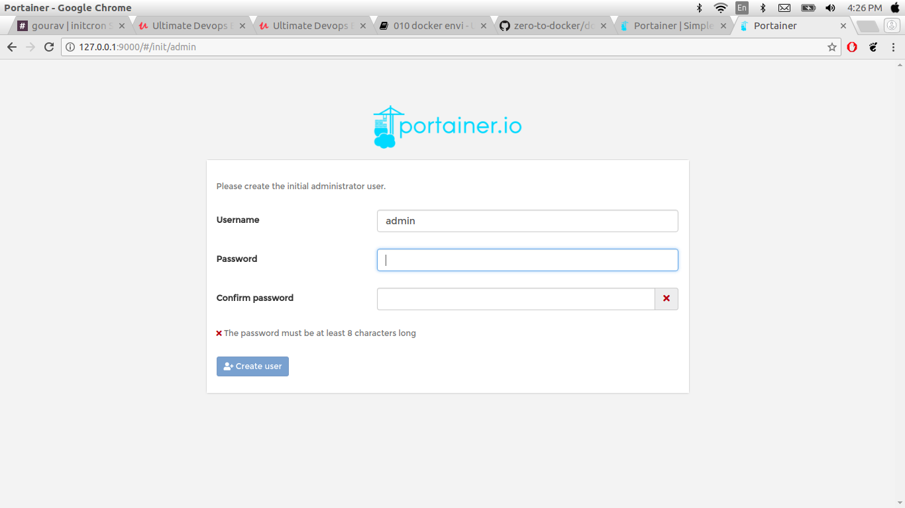
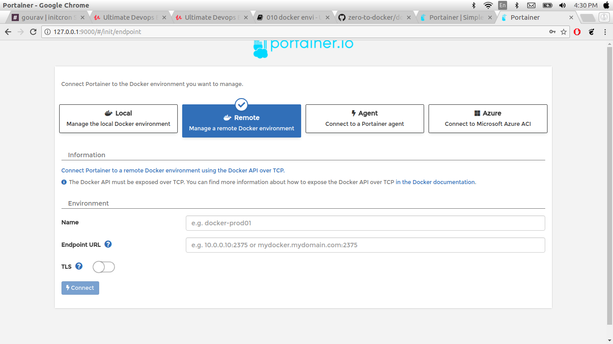
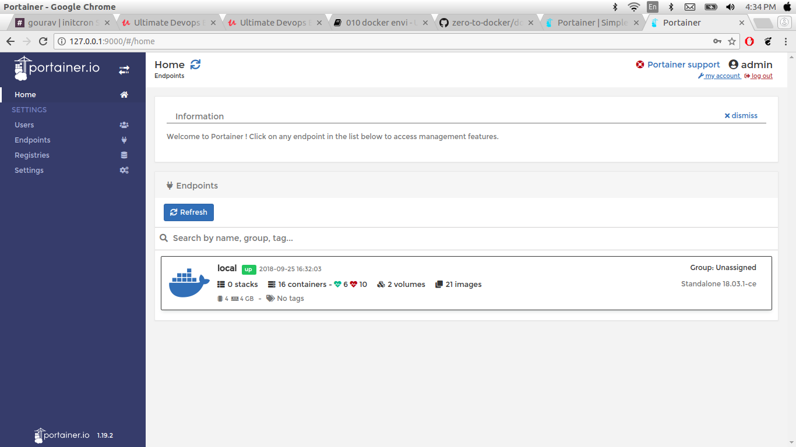
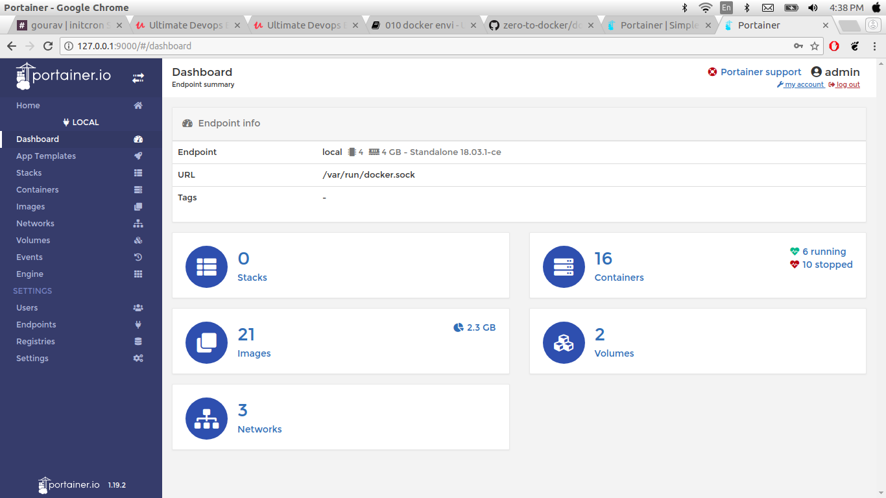

available# Lab: Running and Operating Containers with Docker

In this lab, you will learn, how to launch and operate linux containers with docker.


## Running your first Docker Container

when your environment ready you can start your first docker container . when you running your first docker container you need docker registry. Go to [docker public registry](https://hub.docker.com/). when you visit docker hub you can see bunch of images available here.

we are going to pick basic os image alpine . alpine is distribution of linux, ubuntu etc why we are choosing this image because of footprint of image and you can look at the size of the image look like 2 0r 3 mb that is really good for smoke testing and running smaller images.


Now we have a basic understanding of docker command and sub commands, let us dive straight into launching our very first container

```
docker container run alpine:3.6 uptime
```
Where,

* we are using docker client to
* run a application/command uptime using
* an image by name alpine

[output]

```
Unable to find image 'alpine:3.6' locally
3.6: Pulling from library/alpine
117f30b7ae3d: Pull complete
Digest: sha256:02eb5cfe4b721495135728ab4aea87418fd4edbfbf83612130a81191f0b2aae3
Status: Downloaded newer image for alpine:3.6
 07:45:40 up  3:13,  load average: 0.00, 0.00, 0.00
```
**What happened?**
This command will

* Pull the alpine image file from docker hub, a cloud registry
* Create a runtime environment/ container with the above image
* Launch a program (called uptime) inside that container
* Stream that output to the terminal
* Stop the container once the program is exited

Let's see what happens when we run that command again,

[Output]

```
docker run alpine uptime
 07:48:06 up  3:15,  load average: 0.00, 0.00, 0.00
```

### Checking Status of the containers


We have understood how docker run commands works. But what if you want to see list of running containers and history of containers that had run and exited? This can be done by executing the following commands

```
docker ps
```
[output]

```
CONTAINER ID        IMAGE               COMMAND             CREATED             STATUS              PORTS               NAMES
```
This command doesn't give us any information. Because, **docker ps** command will only show list of container(s) which are **running**

```
docker ps -l
```
[output]

```
CONTAINER ID        IMAGE               COMMAND             CREATED              STATUS                          PORTS               NAMES
988f4d90d604        alpine              "uptime"            About a minute ago   Exited (0) About a minute ago                       fervent_hypatia
```
The **-l** flag shows the last run container along with other details like image it used, command it executed, return code of that command, etc.,

```
docker ps -n 2
```
[output]

```
NAMES
988f4d90d604        alpine              "uptime"            About a minute ago   Exited (0) About a minute ago                       fervent_hypatia
acea3023dca4        alpine              "uptime"            3 minutes ago        Exited (0) 3 minutes ago                            mad_darwin
```

Docker gives us the flexibility to show the desirable number of last run containers. This can be achieved by using -n **no_of_results** flag

```
docker ps -a

```
[output]

```
CONTAINER ID        IMAGE                        COMMAND                  CREATED              STATUS                          PORTS                  NAMES
988f4d90d604        alpine                       "uptime"                 About a minute ago   Exited (0) About a minute ago                          fervent_hypatia
acea3023dca4        alpine                       "uptime"                 4 minutes ago        Exited (0) 4 minutes ago                               mad_darwin
60ffa94e69ec        ubuntu:14.04.3               "bash"                   27 hours ago         Exited (0) 26 hours ago                                infallible_meninsky
dd75c04e7d2b        schoolofdevops/ghost:0.3.1   "/entrypoint.sh npm s"   4 days ago           Exited (0) 3 days ago                                  kickass_bardeen
c082972f66d6        schoolofdevops/ghost:0.3.1   "/entrypoint.sh npm s"   4 days ago           Exited (0) 3 days ago           0.0.0.0:80->2368/tcp   sodcblog
```
This command will show all the container we have run so far.


### Making container persist with -idt options


We can interact with docker containers by giving -it flags at the run time. These flags stand for

* i - Interactive
* t - tty
* d - detach

```
docker container run -it alpine:3.4 sh
```
[ouput]

```
Unable to find image 'alpine:3.4' locally
3.4: Pulling from library/alpine

e110a4a17941: Pull complete
Digest: sha256:3dcdb92d7432d56604d4545cbd324b14e647b313626d99b889d0626de158f73a
Status: Downloaded newer image for alpine:3.4
/ #

```
As you see, we have landed straight into **sh** shell of that container. This is the result of using **-it** flags and mentioning that container to run the **sh** shell. Don't try to exit that container yet. We have to execute some other commands in it to understand the next topic

if you go inside the container


#### Namespaced

Like a full fledged OS, Docker container has its own namespaces
This enables Docker container to isolate itself from the host as well as other containers
Run the following commands and see that alpine container has its own namespaces and not inheriting much from **host OS**

```
cat /etc/issue
```

```
Welcome to Alpine Linux 3.4
Kernel \r on an \m (\l)

/ #

```

command

```
pa aux
```
[output]

```
PID   USER     TIME   COMMAND
    1 root       0:00 sh
    7 root       0:00 ps aux

```

```
ifconfig
```
[output]

```
eth0      Link encap:Ethernet  HWaddr 02:42:AC:11:00:02  
          inet addr:172.17.0.2  Bcast:172.17.255.255  Mask:255.255.0.0
          UP BROADCAST RUNNING MULTICAST  MTU:1500  Metric:1
          RX packets:64 errors:0 dropped:0 overruns:0 frame:0
          TX packets:0 errors:0 dropped:0 overruns:0 carrier:0
          collisions:0 txqueuelen:0
          RX bytes:9402 (9.1 KiB)  TX bytes:0 (0.0 B)

lo        Link encap:Local Loopback  
          inet addr:127.0.0.1  Mask:255.0.0.0
          UP LOOPBACK RUNNING  MTU:65536  Metric:1
          RX packets:0 errors:0 dropped:0 overruns:0 frame:0
          TX packets:0 errors:0 dropped:0 overruns:0 carrier:0
          collisions:0 txqueuelen:1000
          RX bytes:0 (0.0 B)  TX bytes:0 (0.0 B)

```


### Essential Container Operations - list, logs, exec, cp, inspect, stop, rm

In this section we are looking for some of the essential container operations like list,logs, exec etc.

First we  list the containers

```
docker ps -a
```
[output]

```
CONTAINER ID        IMAGE               COMMAND             CREATED             STATUS                         PORTS               NAMES
60c643264937        alpine:3.4          "sh"                16 minutes ago      Exited (0) 2 minutes ago                           kind_babbage
105b0de546cb        ubuntu              "bash"              About an hour ago   Exited (0) About an hour ago                       admiring_cori
8801c9dc6617        hello-world         "/hello"            2 hours ago         Exited (0) 2 hours ago                             hardcore_blackwell

```

change the container name

```
docker rename kind_babbage loop
```
[output]

```
CONTAINER ID        IMAGE               COMMAND             CREATED             STATUS                         PORTS               NAMES
60c643264937        alpine:3.4          "sh"                17 minutes ago      Exited (0) 2 minutes ago                           loop
105b0de546cb        ubuntu              "bash"              About an hour ago   Exited (0) About an hour ago                       admiring_cori
8801c9dc6617        hello-world         "/hello"            2 hours ago         Exited (0) 2 hours ago                             hardcore_blackwell

```
look at the name of the first container

If you want to follow the log in real-time, use -f flag

```
docker logs 5a75df45379c
```
[output]

```
PID   USER     TIME  COMMAND
    1 root      0:00 ps aux , uptime

```

docker **exec** this command allows you to run command inside container

```
docker exec e9f957dca1b7 ps aux
```
[output]

```
PID   USER     TIME   COMMAND
    1 root       0:00 /bin/sh
    6 root       0:00 ps aux

```
you can also use docker **inspect** command . this command gives you detail information about container

```
docker inspect e9f957dca1b7
```
[output]

```
[
    {
        "Id": "e9f957dca1b727be04357c77edbb2e2b257b22c0832d9f13b4ff06e3854a1237",
        "Created": "2018-09-25T08:49:47.619188383Z",
        "Path": "/bin/sh",
        "Args": [],
        "State": {
            "Status": "running",
            "Running": true,
            "Paused": false,
            "Restarting": false,
            "OOMKilled": false,
            "Dead": false,
            "Pid": 19679,
            "ExitCode": 0,
            "Error": "",
            "StartedAt": "2018-09-25T08:49:48.794801063Z",
            "FinishedAt": "0001-01-01T00:00:00Z"
        },
        "Image": "sha256:174b26fe09c724368aa2c3cc8f2b979b915a33f7b50c94cd215380d56147cd60",
        "ResolvConfPath": "/var/lib/docker/containers/e9f957dca1b727be04357c77edbb2e2b257b22c0832d9f13b4ff06e3854a1237/resolv.conf",
        "HostnamePath": "/var/lib/docker/containers/e9f957dca1b727be04357c77edbb2e2b257b22c0832d9f13b4ff06e3854a1237/hostname",
        "HostsPath": "/var/lib/docker/containers/e9f957dca1b727be04357c77edbb2e2b257b22c0832d9f13b4ff06e3854a1237/hosts",
        "LogPath": "/var/lib/docker/containers/e9f957dca1b727be04357c77edbb2e2b257b22c0832d9f13b4ff06e3854a1237/e9f957dca1b727be04357c77edbb2e2b257b22c0832d9f13b4ff06e3854a1237-json.log",
        "Name": "/xenodochial_hugle",
        "RestartCount": 0,
        "Driver": "overlay2",
        "Platform": "linux",
        "MountLabel": "",
        "ProcessLabel": "",
        "AppArmorProfile": "docker-default",
        "ExecIDs": null,
        "HostConfig": {
            "Binds": null,
            "ContainerIDFile": "",
            "LogConfig": {
                "Type": "json-file",
                "Config": {}
            },
            "NetworkMode": "default",
            "PortBindings": {},
            "RestartPolicy": {
                "Name": "no",
                "MaximumRetryCount": 0
            },
            "AutoRemove": false,
            "VolumeDriver": "",
            "VolumesFrom": null,
            "CapAdd": null,
            "CapDrop": null,
            "Dns": [],
            "DnsOptions": [],
            "DnsSearch": [],
            "ExtraHosts": null,
            "GroupAdd": null,
            "IpcMode": "shareable",
            "Cgroup": "",
            "Links": null,
            "OomScoreAdj": 0,
            "PidMode": "",
            "Privileged": false,
            "PublishAllPorts": false,
            "ReadonlyRootfs": false,
            "SecurityOpt": null,
            "UTSMode": "",
            "UsernsMode": "",
            "ShmSize": 67108864,
            "Runtime": "runc",
            "ConsoleSize": [
                0,
                0
            ],
            "Isolation": "",
            "CpuShares": 0,
            "Memory": 0,
            "NanoCpus": 0,
            "CgroupParent": "",
            "BlkioWeight": 0,
            "BlkioWeightDevice": [],
            "BlkioDeviceReadBps": null,
            "BlkioDeviceWriteBps": null,
            "BlkioDeviceReadIOps": null,
            "BlkioDeviceWriteIOps": null,
            "CpuPeriod": 0,
            "CpuQuota": 0,
            "CpuRealtimePeriod": 0,
            "CpuRealtimeRuntime": 0,
            "CpusetCpus": "",
            "CpusetMems": "",
            "Devices": [],
            "DeviceCgroupRules": null,
            "DiskQuota": 0,
            "KernelMemory": 0,
            "MemoryReservation": 0,
            "MemorySwap": 0,
            "MemorySwappiness": null,
            "OomKillDisable": false,
            "PidsLimit": 0,
            "Ulimits": null,
            "CpuCount": 0,
            "CpuPercent": 0,
            "IOMaximumIOps": 0,
            "IOMaximumBandwidth": 0
        },
        "GraphDriver": {
            "Data": {
                "LowerDir": "/var/lib/docker/overlay2/517ee8ad38d79c97b5b4d9351058cf658265bbd752ffca764d6123cd5a45d7a3-init/diff:/var/lib/docker/overlay2/0ff2c00ee39d00f3cbdee2538e5bd08c0650b0a7531e6277513fb1411177c056/diff",
                "MergedDir": "/var/lib/docker/overlay2/517ee8ad38d79c97b5b4d9351058cf658265bbd752ffca764d6123cd5a45d7a3/merged",
                "UpperDir": "/var/lib/docker/overlay2/517ee8ad38d79c97b5b4d9351058cf658265bbd752ffca764d6123cd5a45d7a3/diff",
                "WorkDir": "/var/lib/docker/overlay2/517ee8ad38d79c97b5b4d9351058cf658265bbd752ffca764d6123cd5a45d7a3/work"
            },
            "Name": "overlay2"
        },
        "Mounts": [],
        "Config": {
            "Hostname": "e9f957dca1b7",
            "Domainname": "",
            "User": "",
            "AttachStdin": false,
            "AttachStdout": false,
            "AttachStderr": false,
            "Tty": true,
            "OpenStdin": true,
            "StdinOnce": false,
            "Env": [
                "PATH=/usr/local/sbin:/usr/local/bin:/usr/sbin:/usr/bin:/sbin:/bin"
            ],
            "Cmd": [
                "/bin/sh"
            ],
            "ArgsEscaped": true,
            "Image": "alpine:3.4",
            "Volumes": null,
            "WorkingDir": "",
            "Entrypoint": null,
            "OnBuild": null,
            "Labels": {}
        },
        "NetworkSettings": {
            "Bridge": "",
            "SandboxID": "a819dc4b5b24f71699cc58804ba227dfbfcd1431deab0bea5fe27ab5b97cc95e",
            "HairpinMode": false,
            "LinkLocalIPv6Address": "",
            "LinkLocalIPv6PrefixLen": 0,
            "Ports": {},
            "SandboxKey": "/var/run/docker/netns/a819dc4b5b24",
            "SecondaryIPAddresses": null,
            "SecondaryIPv6Addresses": null,
            "EndpointID": "9de8e6914d71fc9b6d569a56ebaeae58aeb1fa21717aa1d94f200d22d82e0d37",
            "Gateway": "172.17.0.1",
            "GlobalIPv6Address": "",
            "GlobalIPv6PrefixLen": 0,
            "IPAddress": "172.17.0.2",
            "IPPrefixLen": 16,
            "IPv6Gateway": "",
            "MacAddress": "02:42:ac:11:00:02",
            "Networks": {
                "bridge": {
                    "IPAMConfig": null,
                    "Links": null,
                    "Aliases": null,
                    "NetworkID": "a379dcbffa8fff8004d04727d8898d46cf032a830a18d8507d7acbb3d14c552a",
                    "EndpointID": "9de8e6914d71fc9b6d569a56ebaeae58aeb1fa21717aa1d94f200d22d82e0d37",
                    "Gateway": "172.17.0.1",
                    "IPAddress": "172.17.0.2",
                    "IPPrefixLen": 16,
                    "IPv6Gateway": "",
                    "GlobalIPv6Address": "",
                    "GlobalIPv6PrefixLen": 0,
                    "MacAddress": "02:42:ac:11:00:02",
                    "DriverOpts": null
                }
            }
        }
    }
]

```
docker **copy**

```
docker cp testfile e9f957dca1b7:/opt
```
docker **diff**

```
docker diff e9f957dca1b7
```
[output]

```
A /opt

```
docker **stop**

```
docker stop e9f 1b7  
```
[output]

```
e9f
1b7
```

docker **remove**

```
docker rm e9f 1b7
```
[output]

```
e9f
1b7
```


### Publishing containers using port mapping


Now, we have already start container, now access that application outside world, we are going through  to launch container nginx web server image you can choose the image on docker hub registry for latest version.

```
docker container run -idt -P nginx
```
[output]

```
Unable to find image 'nginx:latest' locally
latest: Pulling from library/nginx
802b00ed6f79: Pull complete
e9d0e0ea682b: Pull complete
d8b7092b9221: Pull complete
Digest: sha256:24a0c4b4a4c0eb97a1aabb8e29f18e917d05abfe1b7a7c07857230879ce7d3d3
Status: Downloaded newer image for nginx:latest
6d631d2ecfddb76481e2e75c6f14373dde5907e442231c38c062574cc4b880da
```
Check the port

```
docker ps
```
[output]

```
CONTAINER ID        IMAGE               COMMAND                  CREATED             STATUS              PORTS                   NAMES
6d631d2ecfdd        nginx               "nginx -g 'daemon of…"   49 seconds ago      Up 47 seconds       0.0.0.0:32768->80/tcp   dreamy_gates

```
the container are running on  inside port 80 . If you want to acess on outside use the port 32768. docker are automatically pick up the port
access this outside use your **host_ip:32768** in browser.

you can also define specific port use following command

```
docker container run -idt -p 8888:80 nginx
```

```
docker ps
```
[output]

```
CONTAINER ID        IMAGE               COMMAND                  CREATED             STATUS              PORTS                   NAMES
3104f3f3c062        nginx               "nginx -g 'daemon of…"   52 seconds ago      Up 50 seconds       0.0.0.0:8888->80/tcp    mystifying_golick
6d631d2ecfdd        nginx               "nginx -g 'daemon of…"   11 minutes ago      Up 11 minutes       0.0.0.0:32768->80/tcp   dreamy_gates

```
we going to deploy another web based application ghost

```
docker run -d --name ghost -p 3001:2368 ghost:alpine
```

[output]

```
Unable to find image 'ghost:alpine' locally
alpine: Pulling from library/ghost
4fe2ade4980c: Already exists
eeb7d76f44e7: Pull complete
e35f88fcc259: Pull complete
b4d59ef07366: Pull complete
dcee404d51ae: Pull complete
f0d2c5f09664: Pull complete
6feecb37b3bd: Pull complete
4e29bf9bf09f: Pull complete
Digest: sha256:d1d329a9e28096003ddbce69f3fc4a81b72c2c0c9e88426fc432fd3f0e1146e1
Status: Downloaded newer image for ghost:alpine
4c84890e1f4438a647b287751beeda02490ed7a312c05ae4a64ba7f01047a76b

```

```
docker ps

```
[output]

```
CONTAINER ID        IMAGE               COMMAND                  CREATED             STATUS              PORTS                    NAMES
4c84890e1f44        ghost:alpine        "docker-entrypoint.s…"   40 seconds ago      Up 38 seconds       0.0.0.0:3001->2368/tcp   ghost
3104f3f3c062        nginx               "nginx -g 'daemon of…"   8 minutes ago       Up 8 minutes        0.0.0.0:8888->80/tcp     mystifying_golick
6d631d2ecfdd        nginx               "nginx -g 'daemon of…"   19 minutes ago      Up 19 minutes       0.0.0.0:32768->80/tcp    dreamy_gates

```
this application are running on port 3001 you can see on web browser **host_ip:3001** or **localhost:3001**


### Using docker instead of VMs to create development environments

If you have using vm to runing docker container it takes some extra time to run docker container .
if you want to see all the images use following command. this shows you all the present images in your local environment.

```
docker images
```
[output]

```
ghost                                      alpine              fd8dde6880e2        4 days ago          422MB
alpine                                     3.4                 174b26fe09c7        13 days ago         4.82MB
alpine                                     latest              196d12cf6ab1        13 days ago         4.41MB
hello-world                                latest              4ab4c602aa5e        2 weeks ago         1.84kB
ubuntu                                     latest              cd6d8154f1e1        2 weeks ago         84.1MB

```
if wanna see all the layers of docker image use following command

```
docker image history ghost:alpine
```
[output]

```
IMAGE               CREATED             CREATED BY                                      SIZE                COMMENT
fd8dde6880e2        4 days ago          /bin/sh -c #(nop)  CMD ["node" "current/inde…   0B                  
<missing>           4 days ago          /bin/sh -c #(nop)  EXPOSE 2368/tcp              0B                  
<missing>           4 days ago          /bin/sh -c #(nop)  ENTRYPOINT ["docker-entry…   0B                  
<missing>           4 days ago          /bin/sh -c #(nop) COPY file:984b6359fb5468bd…   584B                
<missing>           4 days ago          /bin/sh -c #(nop)  VOLUME [/var/lib/ghost/co…   0B                  
<missing>           4 days ago          /bin/sh -c #(nop) WORKDIR /var/lib/ghost        0B                  
<missing>           4 days ago          /bin/sh -c set -ex;  mkdir -p "$GHOST_INSTAL…   301MB               
<missing>           4 days ago          /bin/sh -c #(nop)  ENV GHOST_VERSION=2.1.3      0B                  
<missing>           10 days ago         /bin/sh -c #(nop)  ENV GHOST_CONTENT=/var/li…   0B                  
<missing>           10 days ago         /bin/sh -c #(nop)  ENV GHOST_INSTALL=/var/li…   0B                  
<missing>           10 days ago         /bin/sh -c npm install -g "ghost-cli@$GHOST_…   51.3MB              
<missing>           10 days ago         /bin/sh -c #(nop)  ENV GHOST_CLI_VERSION=1.9…   0B                  
<missing>           13 days ago         /bin/sh -c #(nop)  ENV NODE_ENV=production      0B                  
<missing>           13 days ago         /bin/sh -c apk add --no-cache   bash            3.82MB              
<missing>           13 days ago         /bin/sh -c apk add --no-cache 'su-exec>=0.2'    31.8kB              
<missing>           13 days ago         /bin/sh -c #(nop)  CMD ["node"]                 0B                  
<missing>           13 days ago         /bin/sh -c apk add --no-cache --virtual .bui…   4.53MB              
<missing>           13 days ago         /bin/sh -c #(nop)  ENV YARN_VERSION=1.9.4       0B                  
<missing>           13 days ago         /bin/sh -c addgroup -g 1000 node     && addu…   56.7MB              
<missing>           13 days ago         /bin/sh -c #(nop)  ENV NODE_VERSION=8.12.0      0B                  
<missing>           13 days ago         /bin/sh -c #(nop)  CMD ["/bin/sh"]              0B                  
<missing>           13 days ago         /bin/sh -c #(nop) ADD file:25c10b1d1b41d46a1…   4.41MB   
```
If you want to use docker devlopment envireonment just pull the ubuntu and centos image
you can pull images  using docker images

```
docker pull ubuntu
```
[output]

```
Using default tag: latest
latest: Pulling from library/ubuntu
Digest: sha256:de774a3145f7ca4f0bd144c7d4ffb2931e06634f11529653b23eba85aef8e378
Status: Image is up to date for ubuntu:latest

```
pulling centos

```
docker pull centos
```

[output]

```
Using default tag: latest
latest: Pulling from library/centos
256b176beaff: Pull complete
Digest: sha256:6f6d986d425aeabdc3a02cb61c02abb2e78e57357e92417d6d58332856024faf
Status: Downloaded newer image for centos:latest

```

here, the images are ready we are going to create dev environment using ubuntu image

```
docker container run -idt --name dev --net host ubuntu bash
158dfe96692f9381842d009abfea428614fed4d9a16de68d18b408549315fbd9
```

```
docker container run -idt --name dev-centos --net host centos bash
99be0c7548ab3c762d7af2fa0cc73a5ad1505589424d82bea2c065a4f1d3bdf7
```

```
docker ps -n 2

```
[output]

```
CONTAINER ID        IMAGE               COMMAND             CREATED             STATUS              PORTS               NAMES
99be0c7548ab        centos              "bash"              57 seconds ago      Up 56 seconds                           dev-centos
158dfe96692f        ubuntu              "bash"              2 minutes ago       Up 2 minutes                            dev

```

if you want to go inside container use following command


```
 docker exec -it dev bash
```
you can check procees inside the container

```
ps aux
USER       PID %CPU %MEM    VSZ   RSS TTY      STAT START   TIME COMMAND
root         1  0.0  0.0  18508  3004 pts/0    Ss+  10:15   0:00 bash
root        10  0.0  0.0  18508  3384 pts/1    Ss   10:20   0:00 bash
root        20  0.0  0.0  34400  2772 pts/1    R+   10:21   0:00 ps aux

```
you can also run  following command

```
apt-get update
apt-get install vim
touch /opt/testfile

```

```
docker stop dev
docker start dev
```
you can persist the data across. make the changes of dev environment as well , we wiiljust **stop** and **start** contaoner see the changes before start and stop.

```
docker exec -it dev bash
```

excute the following caommand

```
which vim
ls /opt/
```


###  Portainer - Web console to managing Docker Environemnts

In this Section we are goiing for portainer web console which will allow you  web based application which manages your local or remote docker environment. you can also visit the [portainer](https://portainer.io)

```
docker volume create portainer_data
```
[output]

```
portainer_data
```
After creating volume excute following command

```
docker run -d -p 9000:9000 -v /var/run/docker.sock:/var/run/docker.sock -v portainer_data:/data portainer/portainer
```
[output]

```
Unable to find image 'portainer/portainer:latest' locally
latest: Pulling from portainer/portainer
d1e017099d17: Pull complete
d4e5419541f5: Pull complete
Digest: sha256:07c0e19e28e18414dd02c313c36b293758acf197d5af45077e3dd69c630e25cc
Status: Downloaded newer image for portainer/portainer:latest
db7a8c18cdfcae46d6ccb9d3d5ad0a48568fdc8e5827f478f0c44b95b8235bdf

```
 which will aloow container to connect to docker daemon and mange its on.

```
docker ps

```

[output]

```
CONTAINER ID        IMAGE                 COMMAND                  CREATED              STATUS              PORTS                    NAMES
db7a8c18cdfc        portainer/portainer   "/portainer"             About a minute ago   Up About a minute   0.0.0.0:9000->9000/tcp   zen_jepsen
99be0c7548ab        centos                "bash"                   32 minutes ago       Up 32 minutes                                dev-centos
158dfe96692f        ubuntu                "bash"                   34 minutes ago       Up 34 minutes                                dev
4c84890e1f44        ghost:alpine          "docker-entrypoint.s…"   About an hour ago    Up About an hour    0.0.0.0:3001->2368/tcp   ghost
3104f3f3c062        nginx                 "nginx -g 'daemon of…"   About an hour ago    Up About an hour    0.0.0.0:8888->80/tcp     mystifying_golick
6d631d2ecfdd        nginx                 "nginx -g 'daemon of…"   2 hours ago          Up 2 hours          0.0.0.0:32768->80/tcp    dreamy_gates

```

go to web browser use **host_ip:9000** or **loaclhost:9000**



here,we have create the password you it at least 8 char long



here i have to use my local environment

* click on as per your environment
* click on connect



above are the portainer page is already been setup. we dont worry abot how to launch this portainer set up this alredy avaible on docker images.

* clik on local up



here you can see how many container are present , network, volume etc


### Launching Application Stack with Docker Compose

In this sections we are going to launch prometheus applications. the prometheus application are multiple serices present like pushgateawy and alertmanager that wy we need docker-compose file. just clone prometus repo.

```
git clone https://github.com/vegasbrianc/prometheus.git
cd prometheus
cat docker-compose.yaml
```
[output]

```
version: '3.1'

volumes:
    prometheus_data: {}
    grafana_data: {}

networks:
  front-tier:
  back-tier:

services:

  prometheus:
    image: prom/prometheus:v2.1.0
    volumes:
      - ./prometheus/:/etc/prometheus/
      - prometheus_data:/prometheus
    command:
      - '--config.file=/etc/prometheus/prometheus.yml'
      - '--storage.tsdb.path=/prometheus'
      - '--web.console.libraries=/usr/share/prometheus/console_libraries'
      - '--web.console.templates=/usr/share/prometheus/consoles'
    ports:
      - 9090:9090
    links:
      - cadvisor:cadvisor
      - alertmanager:alertmanager
    depends_on:
      - cadvisor
    networks:
      - back-tier
    restart: always
#    deploy:
#      placement:
#        constraints:
#          - node.hostname == ${HOSTNAME}

  node-exporter:
    image: prom/node-exporter
    volumes:
      - /proc:/host/proc:ro
      - /sys:/host/sys:ro
      - /:/rootfs:ro
    command:
      - '--path.procfs=/host/proc'
      - '--path.sysfs=/host/sys'
      - --collector.filesystem.ignored-mount-points
      - "^/(sys|proc|dev|host|etc|rootfs/var/lib/docker/containers|rootfs/var/lib/docker/overlay2|rootfs/run/docker/netns|rootfs/var/lib/docker/aufs)($$|/)"
    ports:
      - 9100:9100
    networks:
      - back-tier
    restart: always
    deploy:
      mode: global

  alertmanager:
    image: prom/alertmanager
    ports:
      - 9093:9093
    volumes:
      - ./alertmanager/:/etc/alertmanager/
    networks:
      - back-tier
    restart: always
    command:
      - '--config.file=/etc/alertmanager/config.yml'
      - '--storage.path=/alertmanager'
#    deploy:
#      placement:
#        constraints:
#          - node.hostname == ${HOSTNAME}
  cadvisor:
    image: google/cadvisor
    volumes:
      - /:/rootfs:ro
      - /var/run:/var/run:rw
      - /sys:/sys:ro
      - /var/lib/docker/:/var/lib/docker:ro
    ports:
      - 8080:8080
    networks:
      - back-tier
    restart: always
    deploy:
      mode: global

  grafana:
    image: grafana/grafana
    user: "104"
    depends_on:
      - prometheus
    ports:
      - 3000:3000
    volumes:
      - grafana_data:/var/lib/grafana
      - ./grafana/provisioning/:/etc/grafana/provisioning/
    env_file:
      - ./grafana/config.monitoring
    networks:
      - back-tier
      - front-tier
    restart: always

```

In this file you can see all the services are defined with portmapping. you can run the following command to run docker compose file

```
docker-compose up -d
```
also use stop and down . stop for stop the all created container and down for delete all create container.

```
docker-compose stop
```

```
docker-compose down
```
