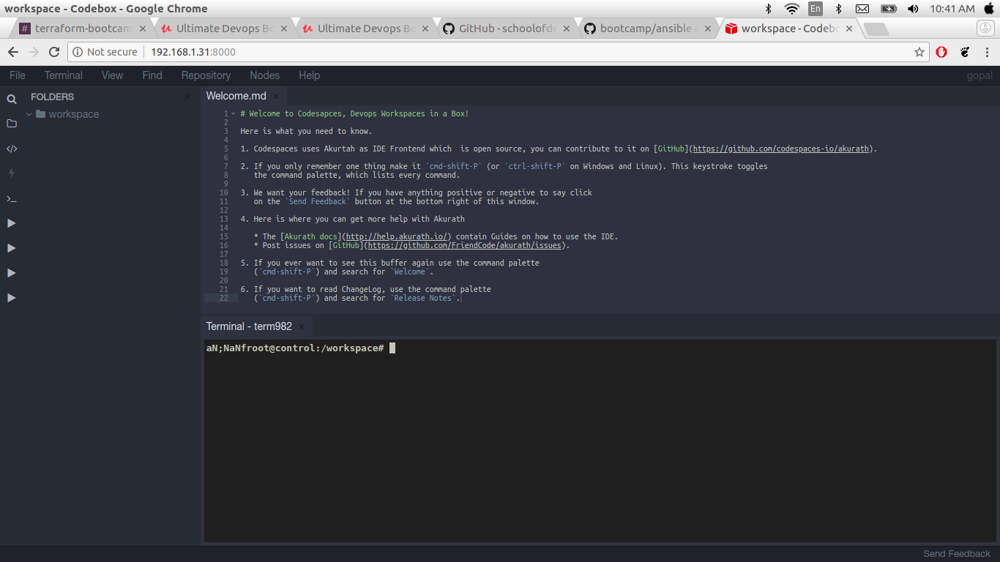

### Setting up codespaces environment

In this section we are going to see how to set codespaces environment using docker and docker compose.
* Clone the git repo.

```
https://github.com/udbc/bootcamp.git
```
#### Start Codespaces IDE

After installing Docker-Engine and Docker-Compose, change directory into the corresponding tool you want to learn. For example, let us assume that you want to learn puppet. In that case,

```
cd bootcamp/setup/
```
Then all you need to do is to run

```
docker-compose up -d
```
This single command will initialize your Codespaces IDE.

#### Use Codespaces IDE

To use Codespaces IDE,

Open your browser.
Visit your machine's IP with port 8000. (Ex. http://192.168.0.60:8080)
You will be asked for your e-mail address. Enter it and you are good to go.


* Now you will be presented with the Codespaces IDE console.



* After setting that environment try to connect other node using ssh and password **codespaces** from this ansible controller

```
ssh devops@frontend
ssh devops@carts
``` 

* After that fork the  source git repo.

```
https://github.com/udbc/bootcamp.git
```

Then, click on Repository tab and clone it

